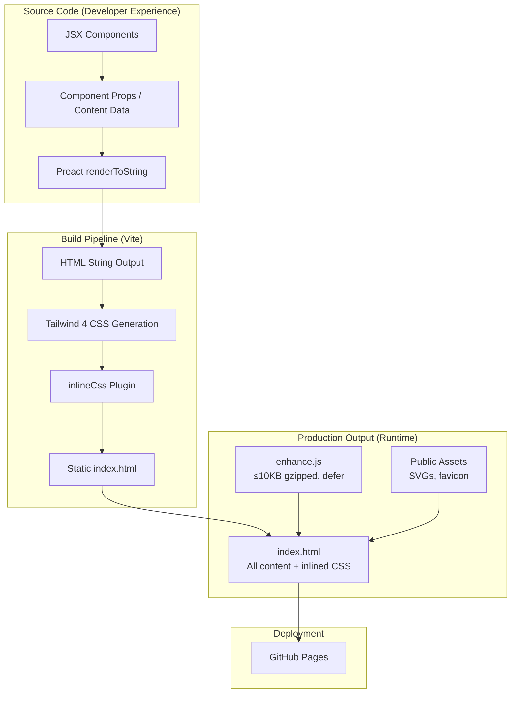
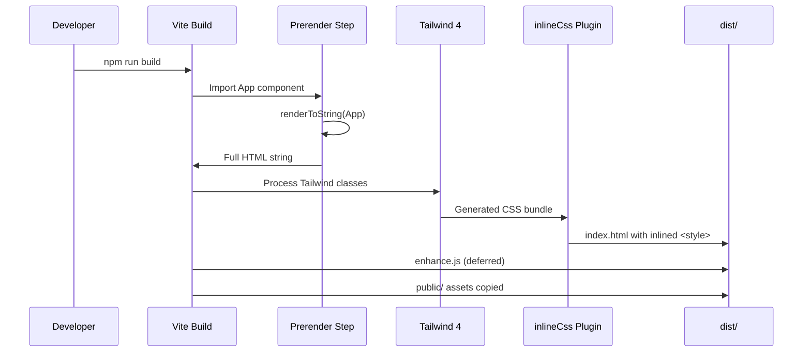
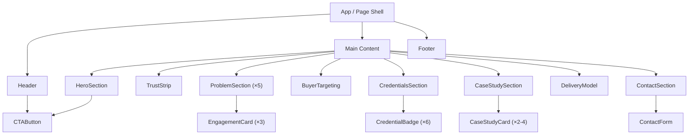

# Design Document: Homepage Redesign

## Overview

This design transforms the GLMU homepage from a Preact single-page application (client-side rendered) into a **static-first, component-based build pipeline** that produces zero-JS-dependency HTML while preserving developer ergonomics. The core architectural decision is to keep Preact/JSX as the **source-code authoring format** (build-time only) and use a prerender step that outputs pure static HTML — satisfying Requirement 24 (no Preact runtime in production) while maintaining the component-based structure the team already works with.

### Key Design Decisions

| Decision | Rationale |
|----------|-----------|
| Keep Preact JSX for source authoring | Team already has JSX components; avoids rewrite while removing runtime dependency |
| Build-time prerender to static HTML | Satisfies Req 19 (critical rendering path elimination), Req 20 (zero JS for render), Req 24 (Preact removal) |
| Inline CSS in HTML output | Already implemented via custom Vite plugin; keeps single-request rendering |
| Deferred vanilla JS for interactivity | Contact form submission, mobile nav toggle — loaded after paint (Req 20.3) |
| Tailwind 4 mobile-first | Base styles = mobile; `min-width` breakpoints for progressive enhancement (Req 18.5, 24.4) |
| GitHub Pages static hosting | No change to deployment model; `dist/` folder contains complete static site |

### What Changes vs. What Stays

**Removed:** `preact` runtime, `@preact/preset-vite` runtime plugin, client-side hydration, `<div id="root">` mounting, dynamic state management for static content.

**Retained:** Vite as build tool, Tailwind 4, `inlineCss()` plugin, GitHub Pages deployment, content structure, existing design language (fonts, colors, spacing).

**Added:** Prerender build step, component decomposition into focused files, deferred enhancement script, static HTML contact form markup.

---

## Architecture

### System Architecture: Build-Time vs. Runtime Boundary



### Build Pipeline Flow



### Component Hierarchy



---

## Components and Interfaces

Each component is a pure function that receives typed props and returns JSX. At build time, Preact's `renderToString` converts the entire tree to static HTML. No hooks, no state, no effects in production output.

### Page Shell (`App.tsx`)

```typescript
// src/App.tsx — Root component, defines section order (Req 14)
interface AppProps {}

export function App(_props: AppProps): JSX.Element
// Returns: <html> shell with all sections in DOM order:
// Header → Hero → TrustStrip → ProblemSections → BuyerTargeting →
// Credentials → CaseStudies → DeliveryModel → Contact → Footer
```

### Header (`components/Header.tsx`)

```typescript
interface HeaderProps {
  ctaLabel: string;    // "Request an Architecture Review" (Req 4.5)
  ctaHref: string;     // "#contact"
}

export function Header(props: HeaderProps): JSX.Element
// Output: <header> sticky nav with GLMU logo + CTA button
// Mobile: hamburger menu (enhanced via deferred JS)
// No JS required for basic display
```

### HeroSection (`components/HeroSection.tsx`)

```typescript
interface HeroSectionProps {
  headline: string;           // h1 — Req 1.1
  subHeadline: string;        // Req 1.2
  tagline: string;            // Req 1.5 (smaller, subordinate)
  differentiator: string;     // Req 1.3
  proofLine: string;          // Req 1.4
  ctaLabel: string;           // Req 4.1
  ctaHref: string;            // "#contact"
}

export function HeroSection(props: HeroSectionProps): JSX.Element
// Output order (Req 1.7): headline → sub-headline → tagline →
//   differentiator → proof line → CTA button
// All content visible without scroll on 1280×800 (Req 1.3, 1.4)
// No first-person language (Req 1.6)
```

### TrustStrip (`components/TrustStrip.tsx`)

```typescript
interface TrustStripProps {
  indicators: string[];  // Req 16.1: exactly 4 indicators
}

export function TrustStrip(props: TrustStripProps): JSX.Element
// Output: horizontal bar, max 2 lines height (Req 16.3)
// Wraps on <768px rather than truncating (Req 16.4)
// Positioned between Hero and Problem sections (Req 16.2)
```

### ProblemSection (`components/ProblemSection.tsx`)

```typescript
interface ProblemSectionProps {
  label: string;                // Section heading (Req 17.1)
  businessImpact: string;       // Executive-level problem (Req 17.2)
  intervention: string;         // What GLMU does (Req 17.2)
  deliverables: string[];       // 2-6 items (Req 17.2)
  expectedOutcome: string;      // Measurable end state (Req 17.2)
}

export function ProblemSection(props: ProblemSectionProps): JSX.Element
// Output: 4 visually distinct subsections in order (Req 17.2)
// Replaces Practice_Area_Cards (Req 17.3)
```

### EngagementCard (`components/EngagementCard.tsx`)

```typescript
interface EngagementCardProps {
  situation: string;            // Initial situation (Req 2.2)
  result: string;               // Outcome achieved (Req 2.2)
  deliverables: string[];       // 2-5 items (Req 2.2)
  duration: string;             // Week range (Req 2.2)
  idealClient: string;          // Ideal client profile (Req 2.2)
  exclusions: string[];         // What's NOT included (Req 2.2)
}

export function EngagementCard(props: EngagementCardProps): JSX.Element
// Output: card leading with situation → result (Req 2.6)
// NOT technology lists or activity descriptions
```

### CredentialBadge (`components/CredentialBadge.tsx`)

```typescript
interface CredentialBadgeProps {
  name: string;               // Certification name (Req 3.1)
  status: 'active' | 'expired';  // Visual distinction (Req 3.4)
  validUntil: string;         // "Dec 2025" format (Req 3.1)
  verifyUrl: string;          // Opens new tab (Req 3.5)
  issuer: 'GCP' | 'AWS' | 'CNCF';
}

export function CredentialBadge(props: CredentialBadgeProps): JSX.Element
// Output: badge with name, status indicator, date, verify link
// Expired: reduced prominence, "Expired" label (Req 3.4)
// Link: target="_blank" rel="noopener noreferrer" (Req 3.5)
```

### CaseStudyCard (`components/CaseStudyCard.tsx`)

```typescript
interface ResultMetric {
  value: string;    // e.g., "40%"
  unit: string;     // e.g., "cost reduction"
}

interface CaseStudyCardProps {
  clientDescription: string;     // Industry + employee range (Req 5.2)
  situation: string;             // Problem statement (Req 5.2)
  actions: string;               // Engagement approach (Req 5.2)
  results: ResultMetric[];       // ≥1 quantified metric (Req 5.2)
}

export function CaseStudyCard(props: CaseStudyCardProps): JSX.Element
// Output: card with client context → situation → actions → metrics
// Multiple metrics displayed as separate elements (Req 5.5)
```

### BuyerTargeting (`components/BuyerTargeting.tsx`)

```typescript
interface BuyerTargetingProps {
  roles: string[];              // Req 7.1: CTO, VP Eng, Head of Platform, Head of Data
  fundingStage: string;         // Req 7.2: "Series B through D"
  teamSize: string;             // Req 7.2: "50 to 500 people"
  geography: string;            // Req 7.2: "European"
  domainFocus: string;          // Req 7.2: cloud/data/AI to production
}

export function BuyerTargeting(props: BuyerTargetingProps): JSX.Element
// Output: single block, visible without JS interaction (Req 7.4, 7.5)
// Positioned within identity section above engagements (Req 7.4)
// No telco/enterprise/training references (Req 7.3)
```

### DistinctiveElements (`components/DistinctiveElements.tsx`)

```typescript
interface DistinctiveElement {
  title: string;
  description: string;   // Measurable result/state change (Req 8.3)
}

interface DistinctiveElementsProps {
  elements: DistinctiveElement[];  // Exactly 4 (Req 8.1)
}

export function DistinctiveElements(props: DistinctiveElementsProps): JSX.Element
// Output: 4 individually distinguishable items (Req 8.1)
// No sole-practitioner language (Req 8.4)
```

### AboutSection (`components/AboutSection.tsx`)

```typescript
interface AboutSectionProps {
  description: string;          // Req 11.1 exact text
  engagementDescription: string; // Req 11.2 exact text
  deliveryModel: string;        // Req 11.3 exact text
  profileUrl: string;           // LinkedIn organizational link (Req 11.5)
}

export function AboutSection(props: AboutSectionProps): JSX.Element
// Output: "About GLMU" section + "Delivery model" subsection
// No personal bios, headshots, first-person language (Req 11.4)
// Credentials as organizational capabilities (Req 11.6)
```

### ContactForm (`components/ContactForm.tsx`)

```typescript
interface ContactFormProps {
  engagementOptions: string[];  // Exactly 3 (Req 4.2)
  apiEndpoint: string;          // web3forms URL
  accessKey: string;            // form submission key
}

export function ContactForm(props: ContactFormProps): JSX.Element
// Output: static HTML form structure (labels, inputs, button)
// Fields: name, company, email, engagement dropdown, challenge textarea
// Placeholder: Req 4.2 specific text
// Labels: organizational language (Req 4.6)
// JS enhancement: loaded via defer for submit handling (Req 24.7)
```

### Footer (`components/Footer.tsx`)

```typescript
interface FooterProps {
  vatNumber: string;            // "IT06158220654" (Req 10.1)
  address: string;              // Full registered address (Req 10.2)
  email: string;                // glmu.cc domain (Req 10.5)
  legalName: string;            // "Gianluigi Mucciolo" (Req 10.3)
}

export function Footer(props: FooterProps): JSX.Element
// Output: legal entity info, consistent with JSON-LD (Req 10.4)
// Last section in DOM order (Req 14.4)
```

---

## Data Models

### Content Data Structure

All page content is defined as typed constants in a central data file, passed as props to components at build time. This separates content from presentation and makes content updates trivial.

```typescript
// src/data/content.ts

export interface SiteContent {
  hero: {
    headline: string;
    subHeadline: string;
    tagline: string;
    differentiator: string;
    proofLine: string;
    ctaLabel: string;
  };
  trustStrip: {
    indicators: string[];
  };
  problems: ProblemData[];      // exactly 5
  engagements: EngagementData[]; // exactly 3
  buyerTarget: BuyerTargetData;
  credentials: CredentialData[]; // exactly 6
  caseStudies: CaseStudyData[]; // 2-4
  testimonials: TestimonialData[];
  distinctiveElements: DistinctiveElementData[]; // exactly 4
  about: AboutData;
  contact: ContactData;
  footer: FooterData;
  seo: SEOData;
}
```

### Build Configuration Model

```typescript
// vite.config.ts additions

interface PrerenderConfig {
  routes: string[];              // ['/'] — single page
  renderer: 'preact';           // renderToString at build time
  injectCSS: boolean;           // true — inline all CSS
  removeRuntime: boolean;       // true — strip Preact from output
  enhanceScript: string | null; // 'enhance.js' — loaded with defer
}
```

### Output File Structure

```
dist/
├── index.html          # Complete static page (HTML + inlined CSS)
├── enhance.js          # Deferred JS (contact form, mobile nav) ≤10KB gzip
├── favicon.svg
├── aws-logo.svg
├── cncf-logo.svg
├── google-cloud-logo.svg
└── llms.txt
```

---

## Error Handling

### Contact Form (Progressive Enhancement)

| Scenario | Behavior |
|----------|----------|
| JS fails to load | Form displays with all fields visible (static HTML). Submit button triggers default form action (no-op or mailto fallback). User sees static "email us at gianlu@glmu.cc" as fallback. |
| Network error on submit | Error message displayed inline (Req 4.8). All field values preserved. Retry available. |
| Invalid email format | Inline validation error before submission (Req 4.9). HTML5 `type="email"` provides browser-native validation as baseline. |
| Server error (non-2xx) | Same as network error handling — user-friendly message, values preserved. |
| Empty required fields | HTML5 `required` attribute provides baseline. JS enhancement adds custom validation messaging. |

### Font Loading Failures

| Scenario | Behavior |
|----------|----------|
| Font CDN unreachable | System font fallback stack renders immediately (`font-display: swap`). Size-adjusted metrics minimize layout shift (Req 23.3). Page remains fully readable. |
| Slow font download | Text visible immediately in fallback font. Swap occurs when font arrives with minimal CLS (Req 23.4 ≤ 0.005). |

### Build Pipeline Failures

| Scenario | Behavior |
|----------|----------|
| Prerender fails | Build step fails fast with clear error. No partial output deployed. |
| CSS inlining fails | Build fails — caught by existing `inlineCss()` plugin error handling. |
| Asset missing | Vite build fails on unresolved import. CI catches before deploy. |

---

## Testing Strategy

### Why Property-Based Testing Does NOT Apply

This feature is primarily about:
1. **Static HTML rendering** — declarative UI output, not algorithmic logic
2. **CSS layout and responsive design** — visual presentation
3. **Build pipeline configuration** — tooling setup
4. **Content placement and ordering** — structural requirements
5. **Performance metrics** — measured via Lighthouse, not unit tests

None of these domains have meaningful universal properties that vary across a wide input space. The "inputs" (content data) are fixed constants, not user-generated. PBT would add overhead without finding bugs that example-based tests miss.

### Testing Approach

#### 1. Build Output Validation (Integration Tests)

Validate that the build produces correct static HTML:

- **Content presence**: All required text from Req 1-11 appears in `dist/index.html`
- **Section order**: DOM order matches Req 14 specification
- **No runtime dependencies**: Output HTML contains no `<script type="module">` pointing to Preact bundles
- **CSS inlined**: No external stylesheet `<link>` tags in output
- **Meta tags**: OG, Twitter Card, canonical, title, description match Req 15
- **JSON-LD**: Valid structured data present (Req 10.3, 13.6)
- **Noscript block**: Contains all required content (Req 13.1, 13.5)

**Tool**: Vitest with DOM parsing (cheerio or jsdom on the built HTML file)

#### 2. Component Snapshot Tests

Each component renders deterministically from props. Snapshot tests catch unintended output changes:

- Render each component with known props
- Assert HTML structure matches snapshot
- Detect regressions when content or markup changes

**Tool**: Vitest + `renderToString` from Preact

#### 3. Accessibility Compliance (Automated Checks)

- Heading hierarchy (h1 → h2 → h3, no skips)
- Form labels associated with inputs
- Link text descriptive (not "click here")
- Color contrast (validated via axe-core on rendered HTML)
- Image SVGs have `aria-label` or `role="img"` with title

**Tool**: axe-core / pa11y on built HTML

#### 4. Performance Testing (Lighthouse CI)

- PageSpeed mobile ≥ 95 (Req 18.1)
- FCP ≤ 1.5s on simulated 4G (Req 24.3)
- LCP ≤ 1.5s on simulated 4G (Req 24.3)
- TBT ≤ 50ms (Req 18.4)
- CLS ≤ 0.01 (Req 21.1)

**Tool**: Lighthouse CI in GitHub Actions

#### 5. Content Compliance Tests

Verify branding constraints programmatically:

- No first-person pronouns in rendered text (Req 9.4)
- No prohibited phrases from Req 9.3 list
- "GLMU" used as subject in service descriptions (Req 9.1)
- No Google Cloud Partner claims (Req 9.6, 12.4)
- No telco/enterprise/training references in buyer targeting (Req 7.3)

**Tool**: Vitest with regex/string matching on rendered HTML

#### 6. Responsive Layout Tests

- Trust strip wraps on <768px without hiding (Req 16.4)
- Hero content visible without scroll on 1280×800 (Req 1.3, 1.4)
- Mobile-first CSS: base styles are mobile, enhancements via `min-width`

**Tool**: Playwright with viewport assertions

#### 7. Contact Form Enhancement Tests

- Form renders as static HTML without JS
- JS enhancement attaches correctly
- Validation rejects empty fields, invalid email
- Success/error states display correctly
- Field values preserved on error

**Tool**: Vitest (unit) + Playwright (integration)

---

## Build Pipeline Design

### Vite Configuration Changes

```typescript
// vite.config.ts — updated

import tailwindcss from '@tailwindcss/vite';
import { defineConfig, type Plugin } from 'vite';
import { renderToString } from 'preact-render-to-string';
import { App } from './src/App';

function prerenderPlugin(): Plugin {
  return {
    name: 'prerender-html',
    enforce: 'post',
    transformIndexHtml(html) {
      // Render the full App component tree to static HTML
      const appHtml = renderToString(App({}));
      // Replace the empty root div with rendered content
      return html.replace(
        '<div id="root"></div>',
        appHtml
      );
    }
  };
}

function inlineCss(): Plugin {
  // ... existing implementation unchanged
}

function removeRuntimeScripts(): Plugin {
  return {
    name: 'remove-runtime-scripts',
    enforce: 'post',
    transformIndexHtml(html) {
      // Remove the Preact module script (no longer needed at runtime)
      return html.replace(
        /<script type="module" src="\/src\/main\.tsx"><\/script>/,
        ''
      );
    }
  };
}

export default defineConfig({
  plugins: [
    tailwindcss(),
    prerenderPlugin(),
    inlineCss(),
    removeRuntimeScripts()
  ],
  build: {
    rollupOptions: {
      input: {
        main: 'index.html',
        enhance: 'src/enhance.ts'  // Deferred JS bundle
      },
      output: {
        entryFileNames: '[name].js'  // enhance.js (no hash — defer loaded)
      }
    }
  }
});
```

### Enhancement Script (`src/enhance.ts`)

Handles all runtime interactivity — loaded with `defer` attribute:

```typescript
// src/enhance.ts — Progressive enhancement (≤10KB gzipped target)

// 1. Contact form submission via fetch API
// 2. Mobile navigation toggle
// 3. Smooth scroll polyfill (if needed)
// 4. Form validation enhancement (beyond HTML5 native)

document.addEventListener('DOMContentLoaded', () => {
  initContactForm();
  initMobileNav();
});
```

### Font Loading Strategy

```html
<!-- Preload primary display font weight -->
<link rel="preload" as="font" type="font/woff2"
      href="https://fonts.gstatic.com/s/plusjakartasans/v8/..."
      crossorigin>

<!-- Async stylesheet load (non-blocking) -->
<link rel="preload" as="style"
      href="https://fonts.googleapis.com/css2?family=..."
      onload="this.onload=null;this.rel='stylesheet'">
```

CSS fallback with size-adjusted metrics:

```css
@font-face {
  font-family: 'Plus Jakarta Sans Fallback';
  src: local('Arial');
  size-adjust: 104%;
  ascent-override: 95%;
  descent-override: 25%;
  line-gap-override: 0%;
}
```

### Mobile-First CSS Strategy (Tailwind 4)

```css
/* Base = mobile (no media query) */
.hero-headline {
  @apply text-2xl font-normal;
}

/* Progressive enhancement for larger screens */
@media (min-width: 640px) {
  .hero-headline { @apply text-4xl; }
}
@media (min-width: 1024px) {
  .hero-headline { @apply text-5xl; }
}
```

In practice, Tailwind utility classes handle this directly:
- `text-2xl sm:text-4xl lg:text-5xl` — mobile-first by default in Tailwind

### Package.json Changes

```json
{
  "dependencies": {},
  "devDependencies": {
    "@tailwindcss/vite": "^4.1.14",
    "tailwindcss": "^4.1.14",
    "typescript": "~5.8.2",
    "vite": "^6.2.3",
    "preact": "^10.29.7",
    "preact-render-to-string": "^6.5.0"
  }
}
```

Key change: `preact` and `preact-render-to-string` move to **devDependencies** only. They are used at build time for rendering but are NOT shipped to production. `@preact/preset-vite` is removed entirely (no client-side JSX transform needed).

### Output Verification

The build produces:
- `dist/index.html` — Complete page, all content as static HTML, CSS inlined in `<style>` tag
- `dist/enhance.js` — Deferred JS for contact form + mobile nav (target ≤10KB gzip)
- `dist/*.svg` — Static assets from `public/`
- No `.js` module files from Preact runtime
- No `<div id="root"></div>` empty container

### index.html Template (Updated)

```html
<!doctype html>
<html lang="en">
  <head>
    <meta charset="UTF-8" />
    <meta name="viewport" content="width=device-width, initial-scale=1.0" />
    <title>Cloud, Data & AI Architecture for Complex Enterprises | GLMU</title>
    <meta name="description" content="Cloud, data, and AI architecture for organisations facing complexity, sovereignty, and scaling constraints. Senior-level ownership from strategy to production handoff." />
    <link rel="canonical" href="https://glmu.cc/" />
    <!-- OG + Twitter meta tags ... -->
    <!-- Font preloads ... -->
    <!-- JSON-LD structured data ... -->
    <style>/* Tailwind CSS inlined at build time */</style>
  </head>
  <body>
    <!-- Full static content rendered by prerender plugin -->
    <header>...</header>
    <main>...</main>
    <footer>...</footer>

    <!-- Noscript fallback (Req 13) -->
    <noscript>...</noscript>

    <!-- Progressive enhancement only -->
    <script src="/enhance.js" defer></script>
  </body>
</html>
```

---

## File Structure (Source)

```
src/
├── App.tsx                     # Root component (page shell + section composition)
├── components/
│   ├── Header.tsx
│   ├── HeroSection.tsx
│   ├── TrustStrip.tsx
│   ├── ProblemSection.tsx
│   ├── EngagementCard.tsx
│   ├── BuyerTargeting.tsx
│   ├── DistinctiveElements.tsx
│   ├── CredentialBadge.tsx
│   ├── CaseStudyCard.tsx
│   ├── AboutSection.tsx
│   ├── ContactForm.tsx
│   ├── Footer.tsx
│   └── Noscript.tsx
├── data/
│   └── content.ts              # All page content as typed constants
├── enhance.ts                  # Deferred JS (form submission, mobile nav)
├── index.css                   # Tailwind imports + custom theme
└── prerender.ts                # Build script: renders App → HTML string
```

---

## Section Order (DOM) — Req 14

1. `<header>` — Sticky nav with GLMU logo + CTA
2. `<main>`
   1. Hero Section (headline, sub-headline, tagline, differentiator, proof line, CTA)
   2. Trust Strip (4 enterprise indicators)
   3. Problem Sections (×5: Fragmented Architecture, Uncontrolled Cloud Economics, AI Without Operational Readiness, Diffused Accountability, Sovereignty and Control)
   4. Engagement Cards (×3: Cloud Platform, AI & Data, Enablement)
   5. Buyer Targeting (roles, company profile)
   6. Expertise Hierarchy (primary: cloud + data + AI; supporting: DevOps, FinOps, security, observability, training)
   7. Credentials (×6 badges + AWS Marketplace link)
   8. Professional Background / About GLMU + Delivery Model
   9. Case Studies (2-4 cards + testimonials)
   10. Contact Section (CTA headline + form)
3. `<footer>` — Legal entity data (VAT, address, email)

---

## Performance Budget

| Metric | Target | Mechanism |
|--------|--------|-----------|
| FCP | ≤ 1.5s (4G mobile) | Static HTML, inlined CSS, no JS blocking |
| LCP | ≤ 1.5s (4G mobile) | h1 in initial HTML, no render delay |
| TBT | ≤ 50ms | Zero JS for initial render; enhance.js is deferred |
| CLS | ≤ 0.01 | No JS-injected DOM; font fallback metrics; explicit SVG dimensions |
| JS payload (initial) | 0 bytes | All content is static HTML |
| JS payload (enhanced) | ≤ 10KB gzip | Contact form + mobile nav only |
| Total HTML + CSS | Target < 50KB | Single request, complete page |
| Cache | 1yr immutable for hashed assets | Content-hashed filenames for SVGs |
